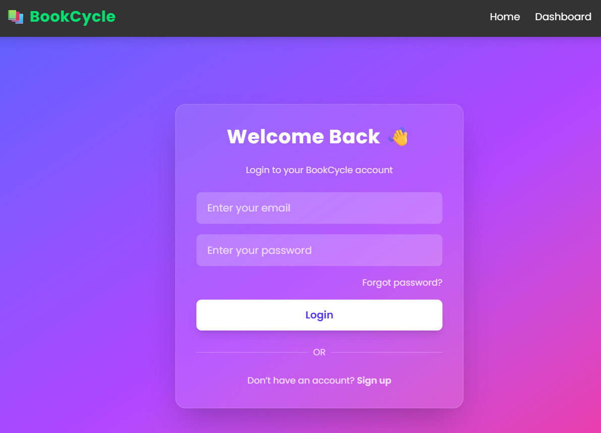
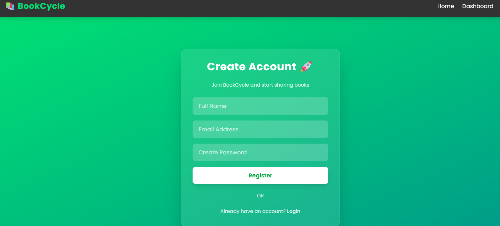
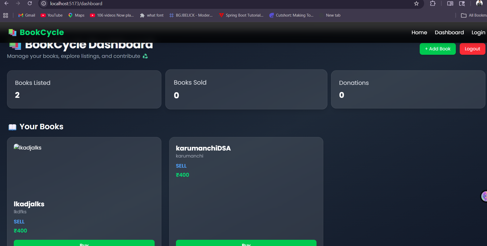
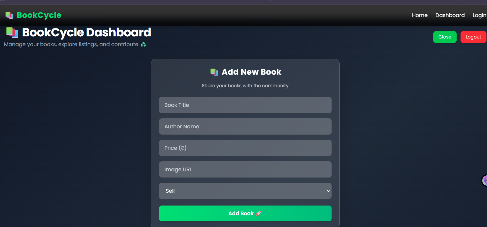

# 📚 BookCycle

> A full-stack microservices-based platform to **buy, sell, and donate books**, promoting sustainability and reuse.

---

## 🚀 Project Overview

**BookCycle** is a scalable web application built using a **microservices architecture**, where users can:

- 📖 Browse books  
- 💰 Sell books  
- 🛒 Buy books  
- 🎁 Donate books  

The platform focuses on **reusability, sustainability, and real-world backend architecture**, making it a strong portfolio project for full-stack development.

---

## 🌟 Key Features

### 🔐 Authentication
- User registration & login
- JWT-based authentication
- Secure API access

---

### 📚 Book Management
- Add books (Sell / Buy / Donate)
- View all books
- Delete books (owner only)

---

### 🔒 Authorization (Ownership Control)
- Only the creator of a book can delete it
- Other users cannot modify or delete чуж data
- Secure validation using JWT

---

### 🛒 Smart UI Logic
- Seller sees **Delete button**
- Other users see **Buy button**
- UI dynamically changes based on ownership

---

### 🖼️ Image Support
- Supports book image URLs
- Easily extendable to Cloudinary for real uploads

---

## 🏗️ System Architecture
Frontend (React + Vite + Tailwind)
↓
API Gateway (Django)
↓
| Auth Service | Book Service |
        ↓
    MongoDB Database

    
---

## 🛠️ Tech Stack

### Frontend
- React (Vite)
- Tailwind CSS
- Axios
- React Router DOM

### Backend
- Django (Microservices)
- Django REST Framework
- JWT Authentication

### Database
- MongoDB (PyMongo)

### Architecture
- Microservices Architecture
- API Gateway Pattern

---

## 📸 Screenshots

> 📁 Place all images inside `/screenshots` folder

### 🔐 Authentication
  

---

### 📊 Dashboard

---

### ➕ Add Book

---

### 📚 Book Listing

---

## 🔁 API Endpoints

### 🔐 Auth Service
POST /api/auth/register/
POST /api/auth/login/

### 📚 Book Service

GET /api/books/
POST /api/books/add/
DELETE /api/books/delete/:id/

2️⃣ Backend Setup
cd backend
python -m venv venv
venv\Scripts\activate
pip install -r requirements.txt

3️⃣ Environment Variables

Create a .env file inside auth_service and book_service:

MONGO_URI=mongodb://localhost:27017/
JWT_SECRET=your_secret_key_here

4️⃣ Run Backend Services
# Auth Service
cd auth_service
python manage.py runserver 8001

# Book Service
cd book_service
python manage.py runserver 8002

# API Gateway
cd api_gateway
python manage.py runserver 8000
5️⃣ Run Frontend
cd frontend
npm install
npm run dev